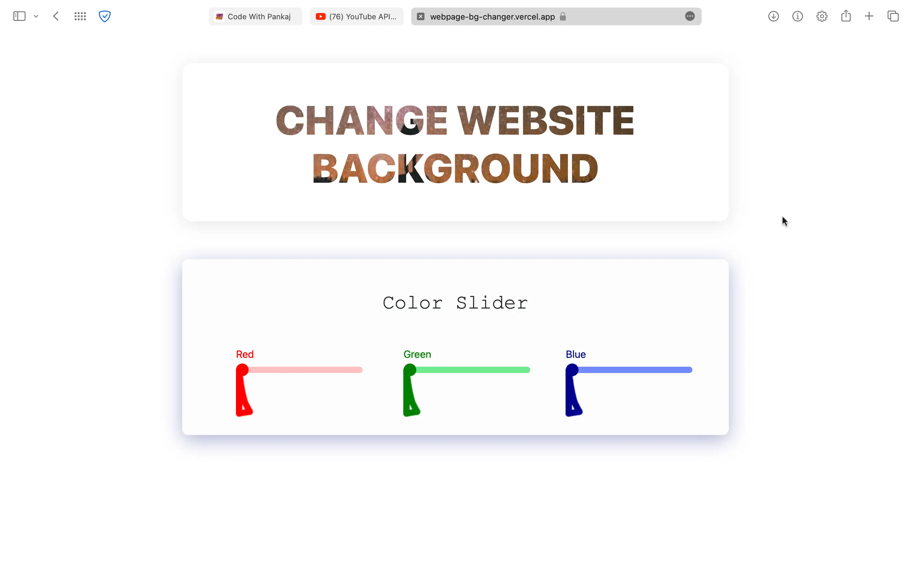

# Webpage-background-changer

A main purpose of this page is to "change the background color of a webpage" according to the needs of the user.

## Features

 - Responsive to all display sizes.
 - Background image auto shifts to different locations.
 - Auto adapt background color according to user need.


## Authors

- [@pankajbaliyan](https://www.github.com/pankajbaliyan)


## Contributing

Contributions are always welcome!

See `index.html` for ways to get started.

Please adhere to this project's `code of conduct`.


## Demo

https://webpage-bg-changer.vercel.app
<br><br>
https://pankajbaliyan.github.io/Webpage-background-changer/


## Feedback

If you have any feedback, please reach out to us at pankajbaliyan90@gmail.com


## 🔗 Links
[](https://codewithpankaj.vercel.app)

[](https://www.linkedin.com/in/pankaj-kumar-90/)

## Lessons Learned

I learned many things while making this repository, i.e. how a webpage is able to adapt unlimited numbers of colors, according to user need.
## Run Locally

Clone the project

```bash
  git clone https://github.com/PankajBaliyan/Webpage-background-changer.git
```

Go to the project directory

```bash
  cd my-project
```

Start code editor

```bash
  code .
```


## Screenshots




## Support

For support, email pankajbaliyan90@gmail.com or join our Slack channel.

